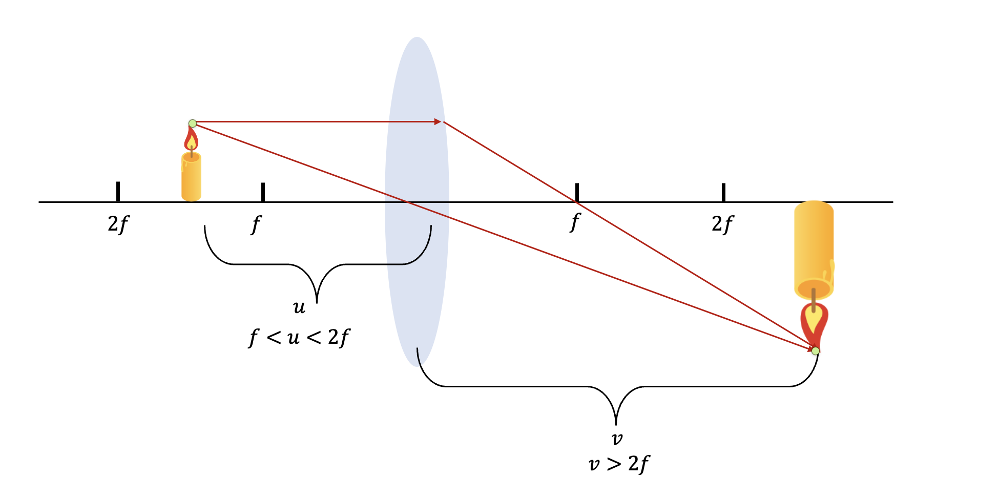
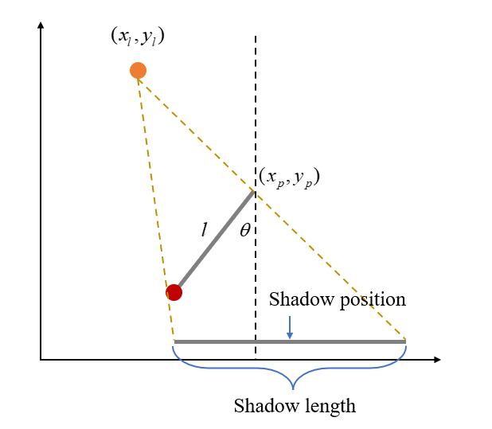
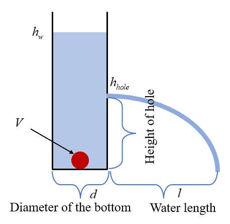
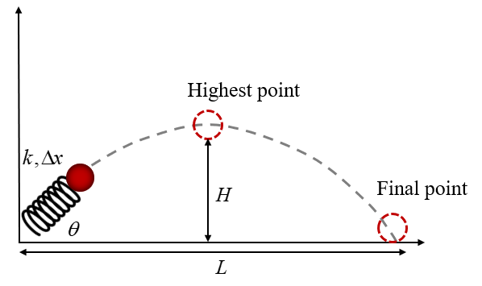

# Causality-informed-Generation

## Step 1 Causality-driven Data Generation (Real-world Style)

### 1. Bar Magnet and Magnetic Needle
- Size: 3 variables

    - A: Position of the bar magnet (angle of rotation).
    - B: Position of the small magnetic needle.
    - C: Orientation of the magnetic field at the needle.

- Formula 

    $$B(\mathbf{r}) = \frac{\mu_0}{4\pi} \left( \frac{3(\mathbf{r} \cdot \mathbf{m}) \mathbf{r}}{r^5} - \frac{\mathbf{m}}{r^3} \right)$$

    Where:
    - **$B(\mathbf{r})$** is the magnetic flux density (magnetic field) at position **$\mathbf{r}$**.
    - **$\mu_0$** is the vacuum permeability, approximately **$4\pi \times 10^{-7} \, \text{H/m}$**.
    - **$\mathbf{m}$** is the magnetic dipole moment.
    - **$\mathbf{r}$** is the position vector from the dipole to the observation point.
    - **$r = |\mathbf{r}|$** is the magnitude of the position vector.

- Graph Structure: 
        
    - A->C, B->C

- Noise

    - Once C is determined by A and B, we can add Gaussian noise on it.

- Linear / Nonlinear

    - This is a linear model.

### 2. Prism Refraction and Reflection

- **Size**: 3 variables

    - A: Wave length of the ray.
    - B: Incident position (coordinate).
    - C: Incident angle.
    - D: Position of refracted ray (coordinate).

- **Formula**: 

    

    

    Where:

    - $x$ and $y$ are the coordinates of the incident position.
    - $\theta_1$ is the incident angle.
    - $n$ is the refractive index determined by $\lambda$.

- **Graph Structure**:

    - A->D, B->D, C->D

- **Noise**:

    - Once D is determined by A, B and C, we can add Gaussian noise on it.

- **Linear / Nonlinear**: 

    - This is a linear model.
 
### 3. Convex Lens

- **Size**: 3 variables

    - A: Distance from the lens to the object.
    - B: Distance from the lens to the image.
    - C: Magnification

- **Formula**:

    $$\frac{1}{f}=\frac{1}{u}+\frac{1}{v}$$
  
    $$m=-\frac{v}{u}$$

    Where:
    
    - $f$ is the focal length.
    - $u$ is the distance from the lens to the object.
    - $v$ is the distance from the lens to the image.
    - m is the manification.
    - "-" means the image is inverted.

- **Graph Structure"**:

    - A->B, B->C, A->C

- **Noise**:

    - We can add Gaussian noise on B and C.

- **Linear / Nonlinear**:

    - This is a nonlinear model.
 
### 4. Double Slit Experiment

- **Size**: 4 variable

    - A: Distance between the slit and the screen.
    - B: The wavelength of light.
    - C: The slit separation.
    - D: Distance between fringes.

- **Formula**: 

    $$\Delta{y}=\frac{L\lambda}{d}$$

    Where

    - $\Delta{y}$ is D.
    - $L$ is A.
    - $\lambda$ is B.
    - $d$ is C.

- **Graph Structure**:

    - A->D, B->D, C->D

- **Noise**:

    - We can add Gaussian noise on D, once it is determined by A, B and C.

- **Linear / Nonlinear**:

    - This is a nonlinear model.

### 5. Spring and Weight

- **Size**: 3 variables

    - A: Gravity of the mass.
    - B: Stiffness coefficient of the spring.
    - C: Displacement produced by the mass.

- **Formula**: 

    $$\Delta{x}=\frac{F}{k}$$

    Where

    - $\Delta{x}$ is C.
    - $F$ is A.
    - $k$ is B.

- **Graph Structure**:

    - A->C, B->C

- **Noise**:

    We can add Gaussian noise on C, once it is determined by A and B.

- **Linear / Nonlinear**:

    - This is a nonlinear model.
    - 
### 6. Pendulum and Light

- **Size**: 5 variables

    - A: Light position.
    - B: Pendulum angle.
    - C: Pendulum length.
    - D: Shadow position.
    - E: Shadow length.

- **Formula**: 

$$
x_{shadow\_left} = -\frac{y_lx_p + y_ll\sin\theta + x_ll\cos\theta - y_px_l}{y_p - l\cos\theta - y_l}
$$

$$
x_{shadow\_right} = -\frac{y_lx_p - y_px_l}{y_p - y_l}
$$

$$
Shadow\_position = \frac{x_{shadow\_left} + x_{shadow\_right}}{2}
$$

$$
Shadow\_length = x_{shadow\_right} - x_{shadow\_left}
$$

Where

- $x_l$ is A.
- $\theta$ is B.
- $l$ is C.
- $Shadow\_position$ is D.
- $Shadow\_length$ is E.

- **Graph Structure**:

    - A->D, B->D, C->D
    - A->E, B->E, D->E

- **Noise**:

    We can add Gaussian noise on D and E.

- **Linear / Nonlinear**:

    - This is a nonlinear model.
 
### 7. Water Flow

- **Size**: 5 variables

    - A: Ball size.
    - B: Diameter of the bottom.
    - C: Water height.
    - D: Hole height.
    - E: Water length.

- **Formula**: 

$$
h_w=h_0+\frac{4V}{\pi{d}}
$$

$$
v_0=\sqrt{2g(h_w-h_{hole})}
$$

$$
t=\sqrt{\frac{2h_{hole}}{g}}
$$

$$
l=v_ot=2\sqrt{h_{hole}(h_w-h_{hole})}
$$

Where

- $V$ is A.
- $d$ is B.
- $h_w$ is C.
- $h_{hole}$ is D.
- $l$ is E.

- **Graph Structure**:

    - A->C, B->C, C->E, D->E

- **Noise**:

    We can add Gaussian noise on C and E.

- **Linear / Nonlinear**:

    - This is a nonlinear model.
 
### 8. Parabola

- **Size**: 4 variables

    - A: Deformation of spring.
    - B: Emergence angle.
    - C: Height of highest point.
    - D: Horizontal distance.

- **Formula**: 

$$
v=\Delta{x}\sqrt{\frac{k}{m}}
$$

$$
L=\frac{v^2sin(2\theta)}{g}=\frac{\Delta{x}^2ksin(2\theta)}{mg}
$$

$$
H=\frac{v^2sin^2(\theta)}{2g}=\frac{\Delta{x}^2ksin^2(\theta)}{2mg}
$$

**Parabolic Equation**

$$
y(x) =x\tan(\theta)-\frac{g}{2v^2\cos^2(\theta)}x^2
$$

Where

- $\Delta{x}$ is A.
- $\theta$ is B.
- $H$ is C.
- $L$ is D.

- **Graph Structure**:

    - A->C, B->C, A->D, B->D

- **Noise**:

    We can add Gaussian noise on B and D.

- **Linear / Nonlinear**:

    - This is a nonlinear model.

# Metrics of Tabular Data
| Baseline |  Metrics  | Dataset:Magnet | Seesaw | Spring | 3 Hypothetical |
|:--------:|:---------:|:--------------:|:------:|:------:|:--------------:|
|    CAM   |    Acc    |      56.25     |  88.89 |  50.00 |      33.33     |
|          | Precision |      16.67     |  66.67 |  0.00  |      0.00      |
|          |   Recall  |      33.33     | 100.00 |  0.00  |      0.00      |
|          |     F1    |      22.22     |  80.00 |  0.00  |      0.00      |
|  NoTears |    Acc    |      87.50     | 100.00 | 100.00 |     100.00     |
|          | Precision |      60.00     | 100.00 | 100.00 |     100.00     |
|          |   Recall  |     100.00     | 100.00 | 100.00 |     100.00     |
|          |     F1    |      75.00     | 100.00 | 100.00 |     100.00     |
|  DAG GNN |    Acc    |      81.25     |  44.44 |  75.00 |     100.00     |
|          | Precision |      50.00     |  0.00  |  0.00  |     100.00     |
|          |   Recall  |      33.33     |  0.00  |  0.00  |     100.00     |
|          |     F1    |      40.00     |  0.00  |  0.00  |     100.00     |
|  DiffAN  |    Acc    |      87.50     |  66.67 | 100.00 |     100.00     |
|          | Precision |     100.00     |  33.33 | 100.00 |     100.00     |
|          |   Recall  |      33.33     |  50.00 | 100.00 |     100.00     |
|          |     F1    |      50.00     |  40.00 | 100.00 |     100.00     |
|    PC    |    Acc    |      75.00     | 100.00 | 100.00 |     100.00     |
|          | Precision |      0.00      | 100.00 | 100.00 |     100.00     |
|          |   Recall  |      0.00      | 100.00 | 100.00 |     100.00     |
|          |     F1    |      0.00      | 100.00 | 100.00 |     100.00     |
|   SCORE  |    Acc    |      87.50     | 100.00 | 100.00 |     100.00     |
|          | Precision |     100.00     | 100.00 | 100.00 |     100.00     |
|          |   Recall  |      33.00     | 100.00 | 100.00 |     100.00     |
|          |     F1    |      50.00     | 100.00 | 100.00 |     100.00     |
