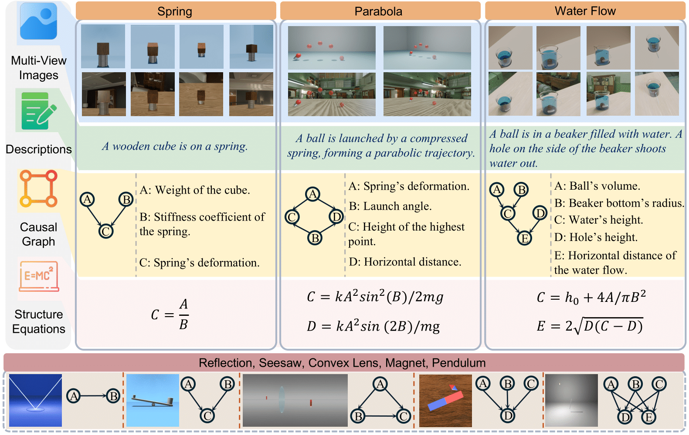

# Causal3D 

<div align="center">
  
  <div style="font-weight: bold; margin-top: 8px;"></div>
</div>

**CAUSAL3D** is a comprehensive benchmark designed to evaluate the ability of AI models to infer latent causal relationships from complex visual data. It integrates **structured tabular data** with corresponding **3D-rendered scenes**, covering diverse causal structures, viewpoints, and visual contexts.


This code repository contains two main section
1. [dataset construction](./construction/)
2. [dataset evaluation](./evaluation/)

## 🚀 Quick Start

**Causal3D** is an image dataset accompanied by tabular files that record the attributes of objects within each scene.

To customize dataset construction, you can modify the code located in the [`construction`](./construction/) folder.

> **Note:** [Blender 4.3.4](https://www.blender.org/download/) must be installed beforehand.

### 🔧 Usage Example

1. Set up a Blender alias (adjust the path to your local installation):
```bash
alias blender="/path/to/Blender"
```
2.	Clone the dataset construction repository:
```
git clone https://github.com/jma712/Causality-informed-Generation.git
cd Causality-informed-Generation
```
3.	Run the Blender script to generate data for the pendulum scene:
```bash
blender -b -P ./construction/src/scene_pendulum_v5.py
```

## 🚀 Evaluation:
After get the rendered images, you can evaluate the dataset using the code in the [`evaluation`](./evaluation/) folder.

Building on prior work in causal discovery and representation learning, we evaluate **Causal3D** using tasks inspired by [causal discovery](./evaluation/readme.md#-causal-discovery-from-tabular-data) and [causal representation learning](./evaluation/readme.md#-causal-representation-learning).


VLMs are further evaluated on causal reasoning tasks, including [causal discovery from few images](./evaluation/readme.md#-causal-discovery-from-few-images-via-vlms) and [causal intervention](./evaluation/readme.md#-causal-intervention-in-vlms).

```python
python ./evaluation/discovery/predict_claude_basic.py       # Causal discovery
python ./evaluation/intervention/intervention_Claude.py      # Causal intervention
```
---
If you use Causal3D in your research, please cite it as follows:
```
@article{liu2025causal3d,
  title={CAUSAL3D: A Comprehensive Benchmark for Causal Learning from Visual Data},
  author={Liu, Disheng and Qiao, Yiran and Liu, Wuche and Lu, Yiren and Zhou, Yunlai and Liang, Tuo and Yin, Yu and Ma, Jing},
  journal={arXiv preprint arXiv:2503.04852},
  year={2025}
}
```

