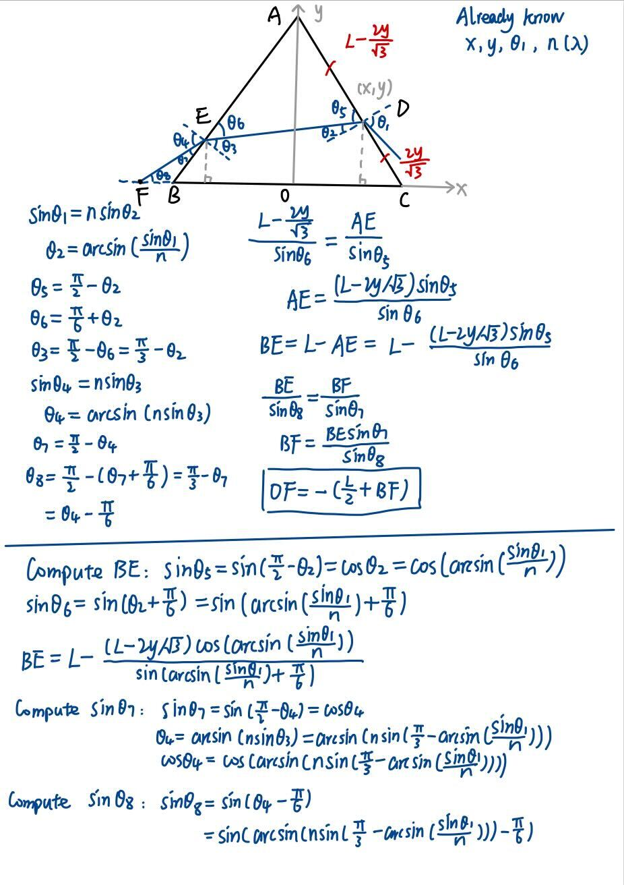
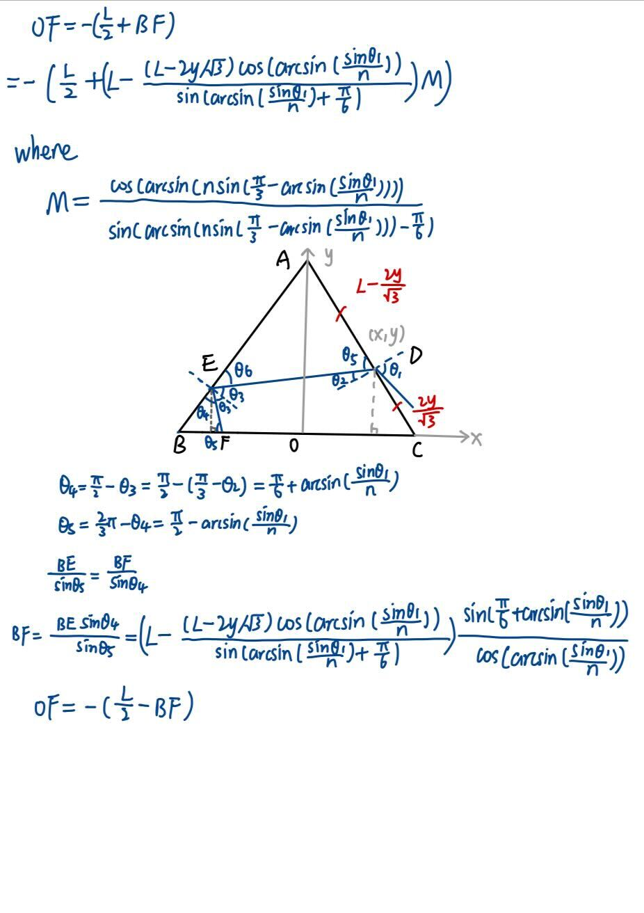

# Causality-informed-Generation

## Step 1 Causality-driven Data Generation (Real-world Style)

### 1. Bar Magnet and Magnetic Needle
- Size: 3 variables

    - A: Position of the bar magnet (angle of rotation).
    - B: Position of the small magnetic needle.
    - C: Orientation of the magnetic field at the needle.

- Formula 

    $$B(\mathbf{r}) = \frac{\mu_0}{4\pi} \left( \frac{3(\mathbf{r} \cdot \mathbf{m}) \mathbf{r}}{r^5} - \frac{\mathbf{m}}{r^3} \right)$$

    Where:
    - **$B(\mathbf{r})$** is the magnetic flux density (magnetic field) at position **$\mathbf{r}$**.
    - **$\mu_0$** is the vacuum permeability, approximately **$4\pi \times 10^{-7} \, \text{H/m}$**.
    - **$\mathbf{m}$** is the magnetic dipole moment.
    - **$\mathbf{r}$** is the position vector from the dipole to the observation point.
    - **$r = |\mathbf{r}|$** is the magnitude of the position vector.

- Graph Structure: 
        
    - A->C, B->C

- Noise

    - Once C is determined by A and B, we can add Gaussian noise on it.

- Linear / Nonlinear

    - This is a linear model.

### 2. Prism Refraction and Reflection

- **Size**: 3 variables

    - A: Wave length of the ray.
    - B: Incident position (coordinate).
    - C: Incident angle.
    - D: Position of refracted ray (coordinate).

- **Formula**: 

    

    

    Where:

    - $x$ and $y$ are the coordinates of the incident position.
    - $\theta_1$ is the incident angle.
    - $n$ is the refractive index determined by $\lambda$.

- **Graph Structure**:

    - A->D, B->D, C->D

- **Noise**:

    - Once D is determined by A, B and C, we can add Gaussian noise on it.

- **Linear / Nonlinear**: 

    - This is a linear model.
 
### 3. Convex Lens

- **Size**: 3 variables

    - A: Distance from the lens to the object.
    - B: Distance from the lens to the image.
    - C: Magnification

- **Formula**:

    $$\frac{1}{f}=\frac{1}{u}+\frac{1}{v}$$
  
    $$m=-\frac{v}{u}$$

    Where:
    
    - $f$ is the focal length.
    - $u$ si the distance from the lens to the object.
    - $v$ is the distance from the lens to the image.
    - m is the manification.
    - "-" means the image is inverted.

- **Graph Structure"**:

    - A->B, B->C, A->C

- **Noise**:

    - We can add Gaussian noise on B and C.

- **Linear / Nonlinear**:

    - This is a nonlinear model.
