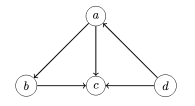

# Causality-informed-Generation

## Step 1 Causality-driven Data Generation

### Style
- Hypothetical
- Real-world style

### Size and graph structure
- Linear Relationship
1. Hypothetical example with 3 variables:

    Variable a = the volume of the ball;  
    Variable b = the height of the cuboid;  
    Variable c = the base area of the pyramid.

    The causal graph is:  
    

2. Hypothetical example with 4 variables:  

    Variable a = the volume of the ball;  
    Variable b = the height of the cylinder;  
    Variable c = the distance between the ball and the cylinder;  
    Variable d = the tilt angle of the cylinder.  

    The causal graph is:  
    

3. Hypothetical example with 5 variables:  

    Variable a = the volume of the ball;  
    Variable b = the height of the cylinder;  
    Variable c = the distance between the ball and the cylinder;  
    Variable d = the volume of the rectangular prism;  
    Variable e = the tilt angle of the cylinder.

    The causal graph is:  
    
   
### Noise  

    In the first hypothetical example, there are 2 noises ε1 and ε2.  
    In the second hypothetical example, there are 3 noise ε1, ε2 and ε3.  
    In the third hypothetical example, the noise ε1, ε2, ε3 and ε4. 
    
### Linear/nonlinear  
    Linear:  
    In the first hypothetical example, b = 2a + ε1; c = 3a + 5b + 5ε2.  
    In the second hypothetical example, a = 3.5d + ε1; b = 3a + ε2; c = 4a + 3b + 9d + 0.7ε3.  
    In the third hypothetical example, b = 5a + ε1; c = 6a + 2b + ε2; d = 2c + ε3; e = 7.5a + 4.5c + 4d + 0.9ε4.  
    
### Background  

    Each example offers four environment options:  

    well-lit indoor, well-lit outdoor, dimly-lit indoor, and dimly-lit outdoor.  

### Interventional do()  

    In the first hypothetical example, we can let users to make interventioans do(a = A) and do(b = B).  
    In the second hypothetical example, we can let users to make interventioans do(a = A), do(b = B) and do(c = C).  
    In the third hypothetical example, we can let users to make interventioans do(a = A), do(b = B), do(c = C) and do(d = D).
- Nonlinear Relationship
## Step 2 SOTA Baselines

### Methods
1. Causal representation learning / causal discovery from image
- CausalVAE

2. LLM?

### Metrics
1. Causal discovery metrics
2. Case studies of intervention
3. Explanations (for LLM)

## Future direction
- 3D/Video
- Graph editing

## References
