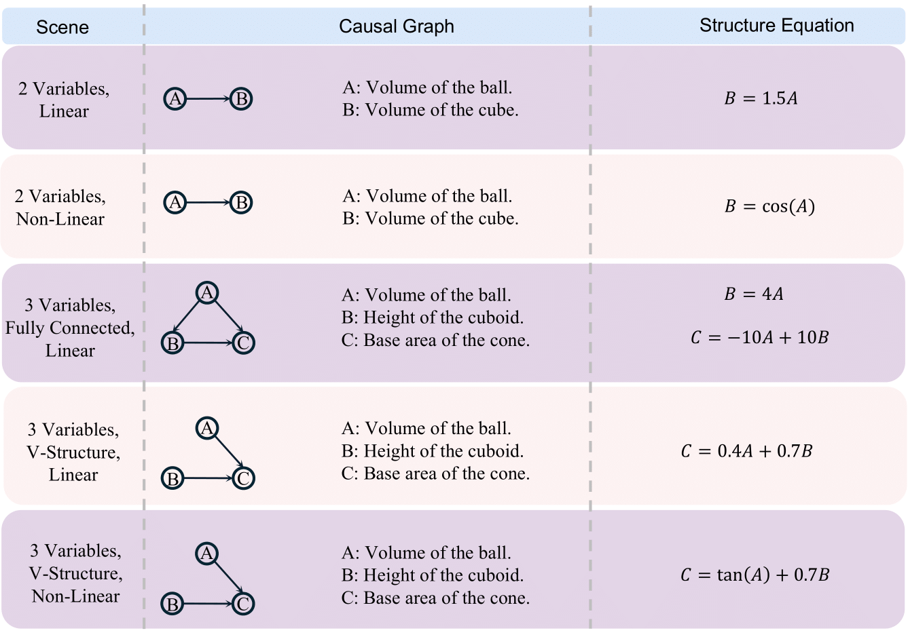
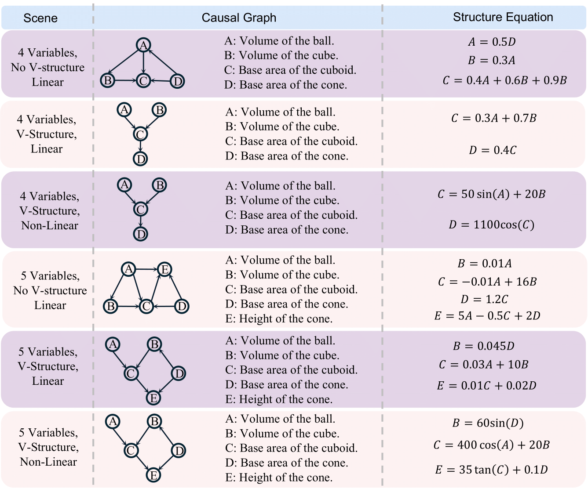
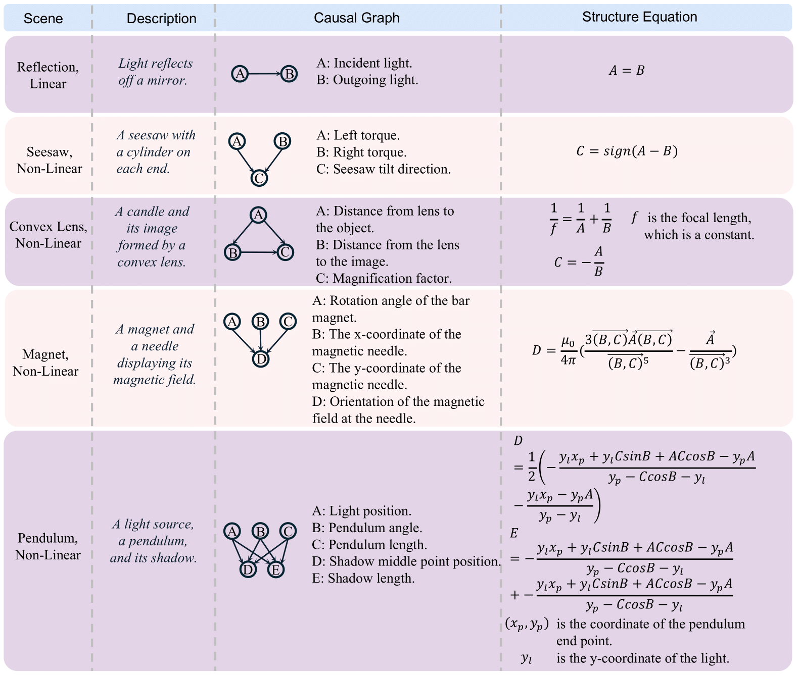

## 🧠 Causal3D: Causality-Informed 3D Dataset Construction

In **Causal3D**, we define a variety of **predefined causal structures** and use [**Blender**](https://www.blender.org/) to render corresponding 3D visual scenes. The entire dataset construction process follows the pipeline illustrated below:

  

---

## 📊 Overview of Predefined Causalities

The following visualizations summarize several predefined causal structures used in **Causal3D**. These include both hypothetical and real-scene examples, capturing diverse object interactions and causal dependencies.

  <table cellspacing="0" cellpadding="0" style="border-spacing: 0;">
    <tr>
      <td align="center" style="padding: 0 5px;">
        <figure style="margin:0">
          
          <figcaption><strong>(a)</strong> Hypothetic Scenes</figcaption>
        </figure>
      </td>
      <td align="center" style="padding: 0 5px;">
        <figure style="margin:0">
          
          <figcaption><strong>(b)</strong> Hypothetic Scenes</figcaption>
        </figure>
      </td>
      <td align="center" style="padding: 0 5px;">
        <figure style="margin:0">
          
          <figcaption><strong>(c)</strong> Real Scenes</figcaption>
        </figure>
      </td>
    </tr>
  </table>

---

## 🛠️ Scene Rendering Code

After defining causal graphs, we use [**Blender**](https://www.blender.org/) to render high-fidelity 3D images based on these structures.  
All related rendering and construction code can be found in the following directory:

👉 [`explore the code`](./src/)