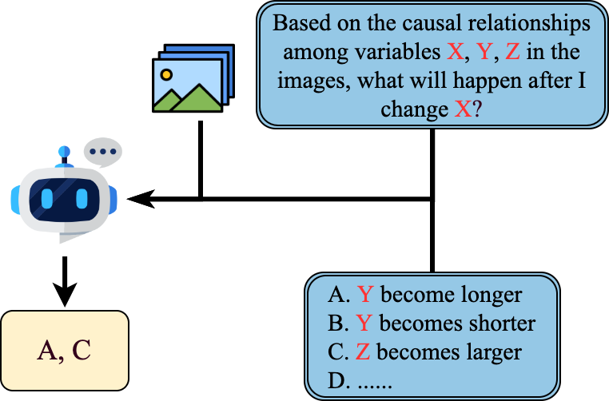

## 🧪 Benchmark Evaluation in Causal3D

To evaluate the capabilities of existing algorithms in learning latent causalities, **Causal3D** provides a benchmark suite with various tasks and metrics. This allows researchers to assess the performance of their methods across diverse causal structures and scenarios.

---

## 📊 Evaluation Tasks

In the **Causal3D** dataset, each scene includes both rendered images and corresponding tabular data. These paired modalities enable evaluation on multiple types of causal learning tasks:

---

### 🔍 Causal Discovery from Tabular Data

We evaluate the performance of various causal discovery methods on tabular data, covering both traditional algorithms and emerging LLM-powered approaches. We assess 7 traditional methods, including CAM, NoTears, DAG GNN, DiffAN, PC, SCORE, and GraN DAG. Additionally, we include the LLM-based method, Causal Copilot.

- [CAM (Causal Additive Model)](https://fentechsolutions.github.io/CausalDiscoveryToolbox/html/causality.html#cam)
- [DAG GNN](https://github.com/ronikobrosly/DAG_from_GNN)
- [PC Algorithm](https://pgmpy.org/structure_estimator/pc.html)
- [GraN-DAG](https://github.com/kurowasan/GraN-DAG)
- [NOTEARS](https://github.com/xunzheng/notears)
- [DiffAN](https://github.com/vios-s/DiffAN)
- [SCORE](https://github.com/paulrolland1307/SCORE)
- [Causal Copilot](https://github.com/Lancelot39/Causal-Copilot)

---

### 🧠 Causal Representation Learning

we evaluate causal representation learning models, including CausalVAE, DEAR, ICM-VAE, and CDG-VAE on our dataset. The images and other information needed by models (e.g., CausalVAE requires annotations of causal variables) are taken as input. These methods are all based on the variational autoencoder (VAE) framework and aim to learn a low-dimensional representation composed of multiple disentangled yet causally related latent variables inside images.

- [CausalVAE](https://github.com/huawei-noah/trustworthyAI/tree/master/research/CausalVAE)
- [DEAR](https://github.com/xwshen51/DEAR)
- [ICM-VAE](https://github.com/Akomand/ICM-VAE)
- [CDG-VAE](https://github.com/an-seunghwan/CDG-VAE)

---

### 🖼️ Causal Discovery from Few Images via VLMs

we leverage pretrained VLMs to perform causal discovery using a small number of images. In this section we use **ChatGPT-4o, Gemini-1.5-Pro, and Claude-3.5-Haiku** to discover causal relations by few images examples and textual prompts in real and hypothetical scenes. The VLMs are tasked with uncovering causal relations by generating adjacency matrices representing causal graphs.

👉 [Explore the code](./discovery/)

---

### 🎯 Causal Intervention in VLMs
This task is formulated as a multiple-choice problem, where the model must
identify the correct outcomes based on induced causal change. The detailed inference pipeline is illustrated in the figure below:

  <figure style="margin: 0; text-align: center;">
    
    <figcaption><strong>Causal Intervention Inference Pipeline</strong></figcaption>
  </figure>

👉 [Explore the code](./intervention/)

